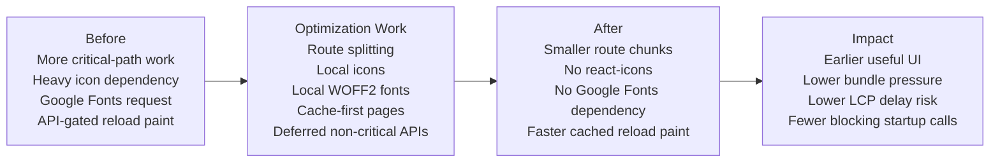
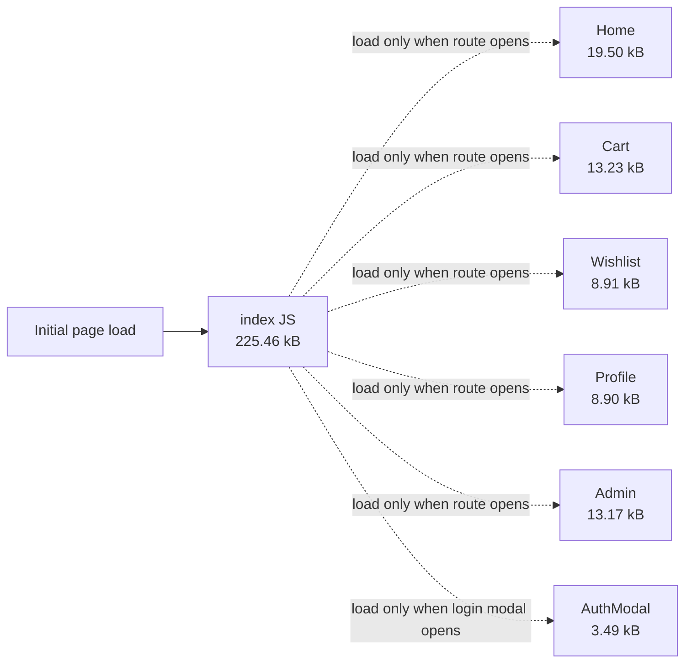
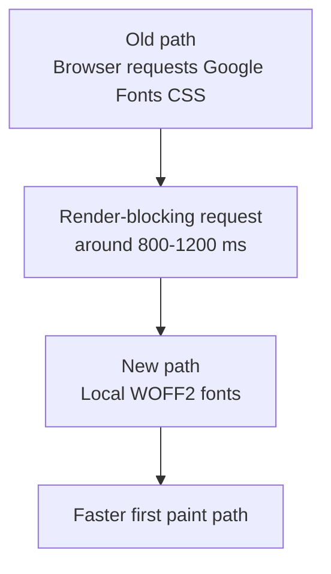
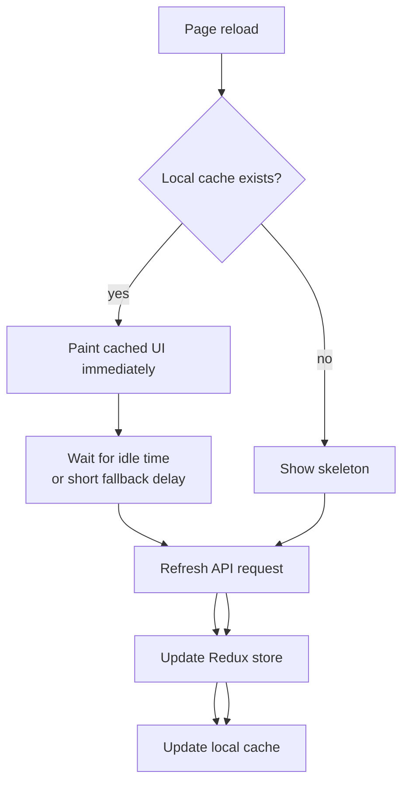
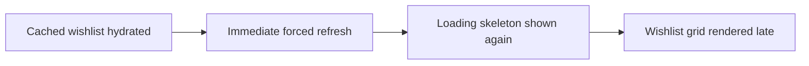
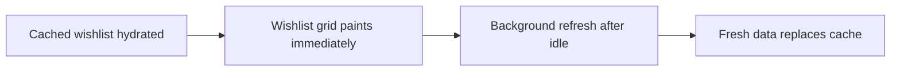
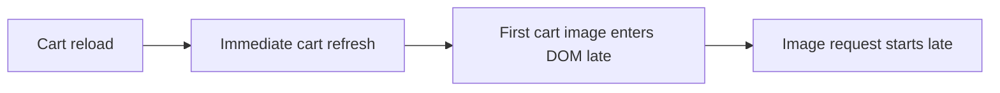
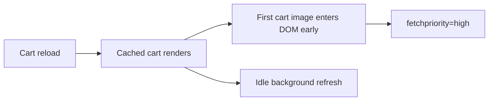
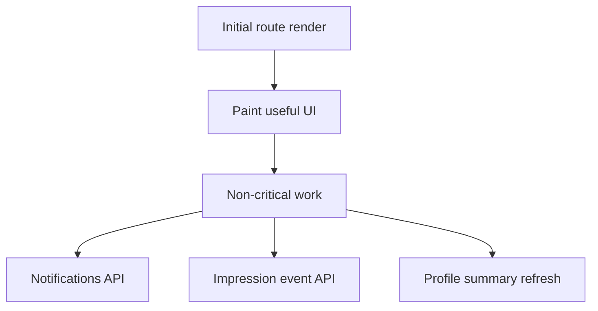
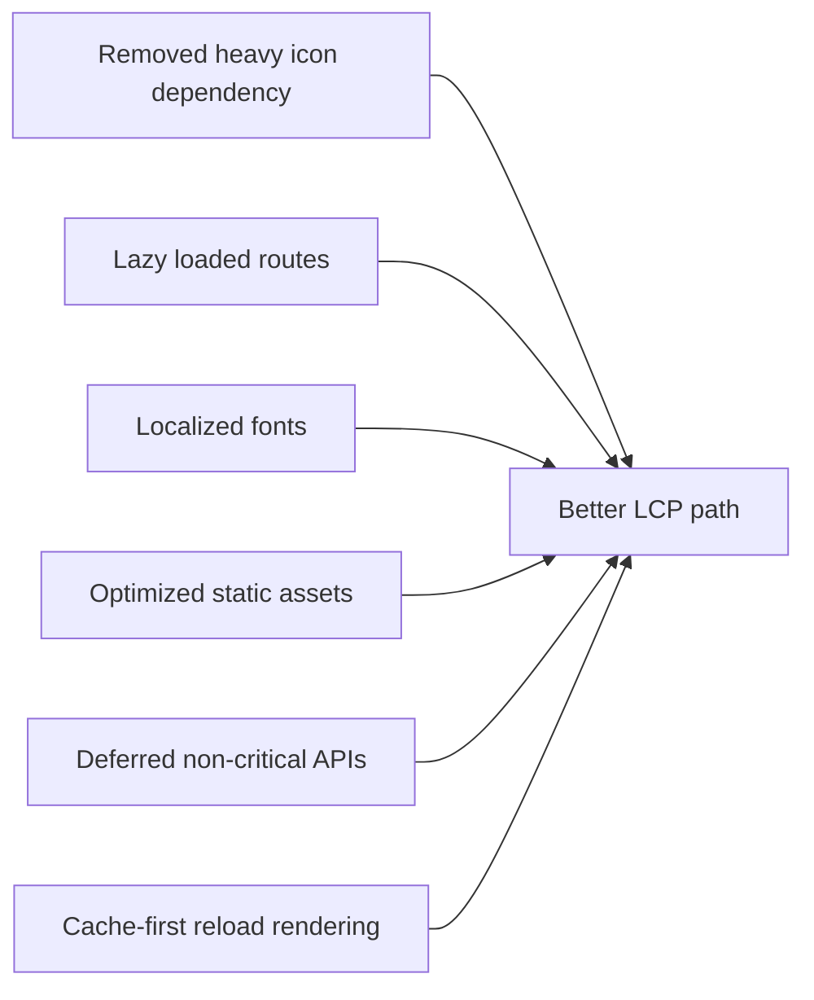

# Sneaky Performance And Bundle Report

This page summarizes the frontend performance work done to reduce render delay, critical-path requests, bundle weight, and reload-time LCP issues.

## Current Production Build Snapshot

```txt
dist        628K
dist/assets 620K
```

| Area | Current Result |
| --- | ---: |
| Main JS bundle | 225.46 kB |
| Main JS gzip | 73.97 kB |
| Largest route chunk | Home: 19.50 kB |
| Cart route chunk | 13.23 kB |
| Wishlist route chunk | 8.91 kB |
| Profile route chunk | 8.90 kB |

## Before / After / Impact



| Area | Before | After | Impact |
| --- | --- | --- | --- |
| Icons | `react-icons` package in dependency graph | Local SVG icon components | Lower dependency weight and better tree control |
| Fonts | Google Fonts CSS request on render path | Local `woff2` fonts emitted by Vite | Removed external render-blocking font CSS request |
| Route loading | More code could be pulled into startup path | Route-level lazy chunks | Initial JS stays smaller; pages load when needed |
| Auth modal | Could be part of regular app path | Lazy loaded only when opened | Login UI does not add cost until used |
| Notifications | `/api/notifications` could appear on Home critical path | Initial fetch deferred | Home paint is less likely to wait on notification API |
| Event tracking | Passive impression event could chain during initial load | Event API deferred with idle callback | User-visible UI gets priority over analytics |
| Profile reload | Summary waited on API for fresh data | Cached summary paints first, refreshes later | Profile feels faster on repeat visits |
| Wishlist reload | Cached data could be hidden by immediate refresh skeleton | Cached wishlist grid stays visible, refresh runs later | Fixes high element render delay risk |
| Cart reload | First cart image entered DOM late during refresh | Cached cart item renders first, refresh runs later | Reduces first image resource load delay risk |
| Product/static images | Larger/default asset formats and unconstrained product requests | AVIF/WebP static assets, constrained product image URLs | Smaller image transfer and more predictable layout |

### Measured Lighthouse Problems Addressed

| Page | Lighthouse Signal Before | Main Cause | Fix Applied | Expected Impact |
| --- | --- | --- | --- | --- |
| Wishlist | Element render delay: `5,960 ms` | Wishlist grid hidden behind loading refresh | Cache-first render and idle refresh | Grid can paint from cache instead of waiting |
| Cart | Resource load delay: `4,610 ms` | LCP image inserted/requested late | Cache-first render, early first image, `fetchpriority=high` | First cart image request starts earlier |
| Home | Notification API appeared in critical request chain: `7,077 ms` | Non-critical notification fetch during startup | Deferred notification fetch | Home LCP less coupled to notifications |
| Profile | Profile summary appeared in critical request chain: `8,457 ms` | Summary API blocked useful route content | Cached summary hydration and idle refresh | Repeat profile loads paint faster |
| Fonts | Render-blocking request estimate: `800-1200 ms` | Google Fonts CSS request | Local WOFF2 font files | Removes external font CSS from critical path |

### Bundle Impact Snapshot

| Metric | Result After Optimization |
| --- | ---: |
| Total `dist` size | 628K |
| Main JS gzip | 73.97 kB |
| Home chunk gzip | 6.22 kB |
| Cart chunk gzip | 3.95 kB |
| Wishlist chunk gzip | 2.82 kB |
| Profile chunk gzip | 2.77 kB |
| `react-icons` dependency | Removed |

## Route Chunking



| Chunk | Size | Gzip |
| --- | ---: | ---: |
| index | 225.46 kB | 73.97 kB |
| Home | 19.50 kB | 6.22 kB |
| Cart | 13.23 kB | 3.95 kB |
| Wishlist | 8.91 kB | 2.82 kB |
| Profile | 8.90 kB | 2.77 kB |
| Admin | 13.17 kB | 3.76 kB |
| AuthModal | 3.49 kB | 1.30 kB |
| Notifications | 2.48 kB | 0.98 kB |

## Dependency Weight Reduction


`react-icons` was removed and replaced with local lightweight icon components.

Verification:

```txt
npm ls react-icons
└── (empty)
```

## Font Critical Path



| Font Asset | Built Size |
| --- | ---: |
| Space Grotesk variable WOFF2 | 48.87 kB |
| Imperial Script WOFF2 | 58.08 kB |

Impact:

| Before | After |
| --- | --- |
| Google Fonts CSS request on critical path | Local font files emitted by Vite |
| Lighthouse showed render-blocking font request | Font request no longer depends on Google Fonts |

## Static Asset Optimization


| Asset | Format | Built Size |
| --- | --- | ---: |
| bell | AVIF | 22.42 kB |
| emptyList | AVIF | 23.20 kB |
| favicon | WebP | 8.59 kB |

Product images also use optimized image URLs with constrained widths, quality parameters, `srcSet`, fixed dimensions, and priority on the first visible item.

## Cache-First Page Rendering

Cart, Wishlist, and Profile now prefer fast local paint first, then refresh in the background.



### Wishlist LCP Fix

Lighthouse input:

| Subpart | Duration |
| --- | ---: |
| Time to first byte | 360 ms |
| Element render delay | 5,960 ms |

Root cause:



Fix:



### Cart LCP Fix

Lighthouse input:

| Subpart | Duration |
| --- | ---: |
| Time to first byte | 400 ms |
| Resource load delay | 4,610 ms |
| Resource load duration | 20 ms |
| Element render delay | 30 ms |

Root cause:



Fix:



## API Critical Path Reduction



Changes:

| Area | Optimization |
| --- | --- |
| Notifications | Initial fetch delayed so it does not block Home LCP |
| Event tracking | Passive impression tracking deferred with idle callback |
| Profile summary | Hydrate from local cache first, then refresh later |
| Cart | Hydrate cached cart first, refresh later |
| Wishlist | Hydrate cached wishlist first, refresh later |

## Verification

```txt
npm run build
```

Passed.

```txt
npm test -- --runTestsByPath src/pages/Cart/Cart.test.tsx --watchAll=false --watchman=false
```

Passed: 6 tests.

```txt
npm test -- --runTestsByPath src/pages/WishList/Wishlist.test.tsx --watchAll=false --watchman=false
```

Passed: 4 tests.

## Summary



The main improvement is that expensive or non-critical work now happens after the first useful paint, while route chunks, icons, fonts, images, Cart, Wishlist, and Profile are lighter or faster to show on reload.
