# Sneaky HLD and LLD Diagrams

## Current Runtime Components

- Kafka topic: `sneaky.user-activity`
- Kafka consumer group: `sneaky-analytics`
- Event API: `POST /api/events`, returns `202 Accepted`
- Event types: `IMPRESSION`, `VIEW`, `CLICK`, `SKIP`, `WISHLIST`, `CART`, `PURCHASE`
- Redis recommendation keys: `recommendations:guest`, `recommendations:user:{userId}`, `recommendations:user:{userId}:personalized`
- Recommendation cache TTL: 15 minutes
- Preference tables: `user_preferences`, `user_brand_preferences`, `user_category_preferences`

## High-Level Design

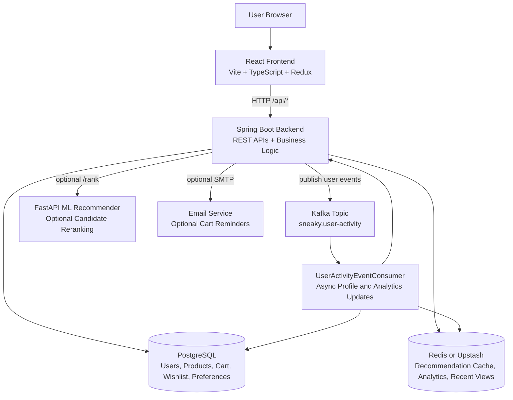

## Runtime Request Flow

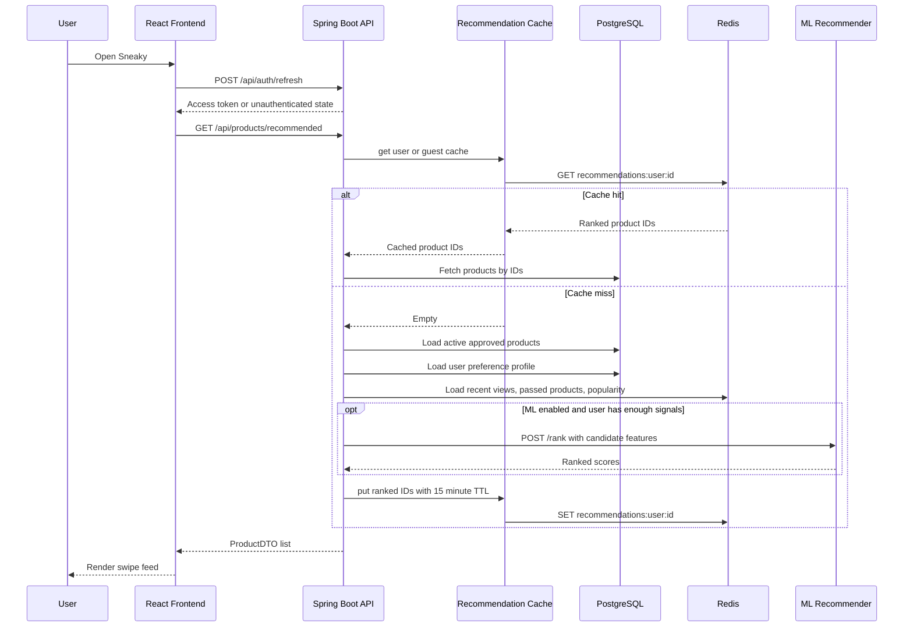

## Frontend Low-Level Design

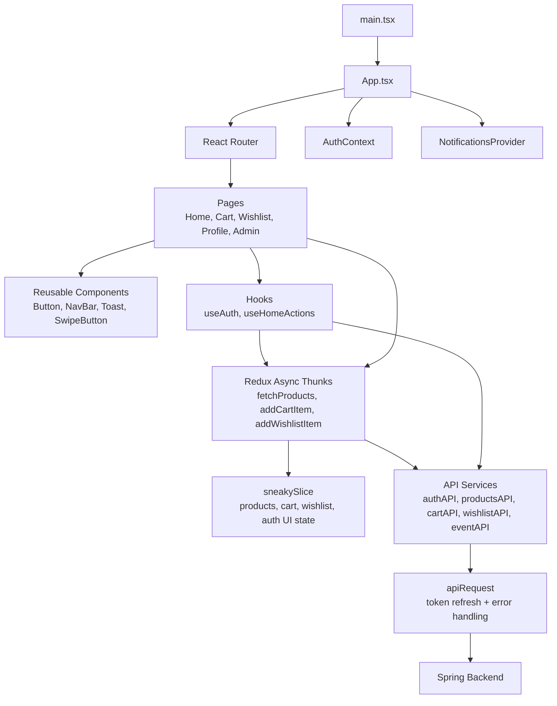

## Backend Low-Level Design

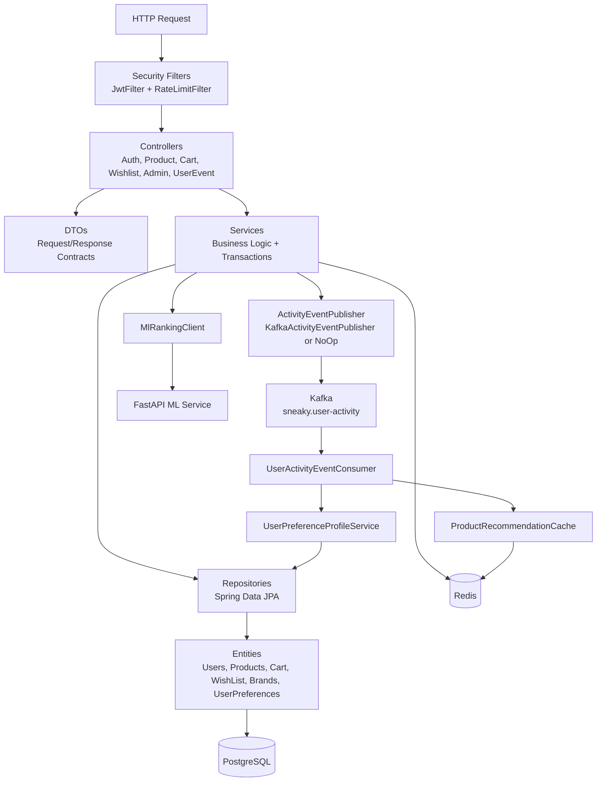

## Event Tracking LLD

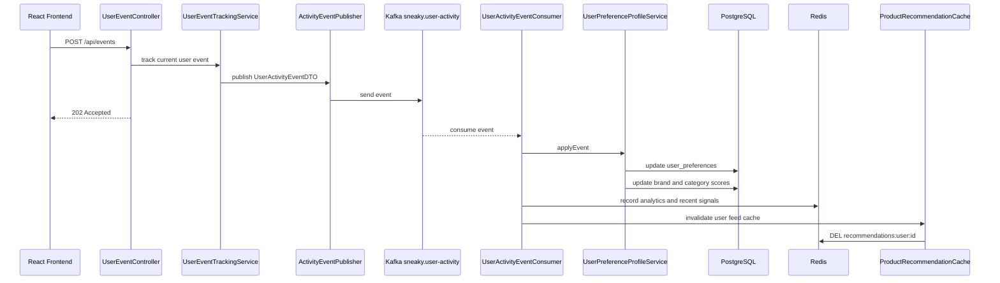

## Preference Profile LLD

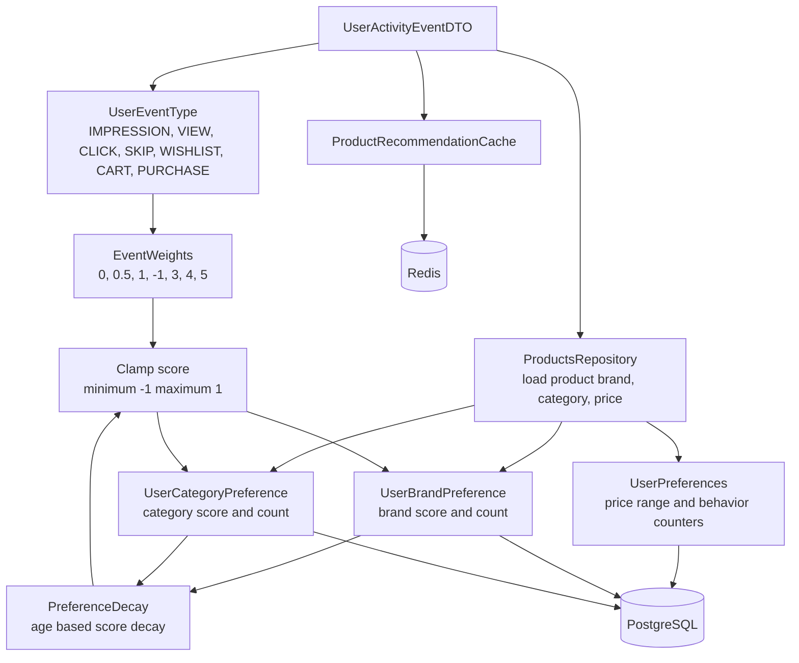

## Recommendation LLD

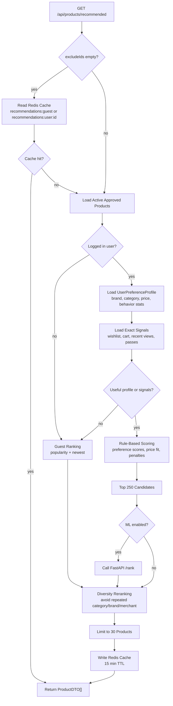

## Cache Invalidation LLD

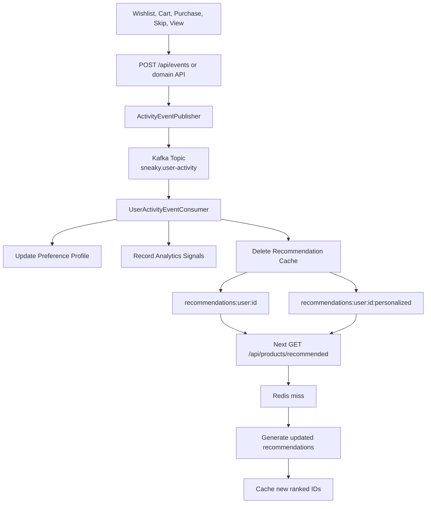

## Authentication LLD

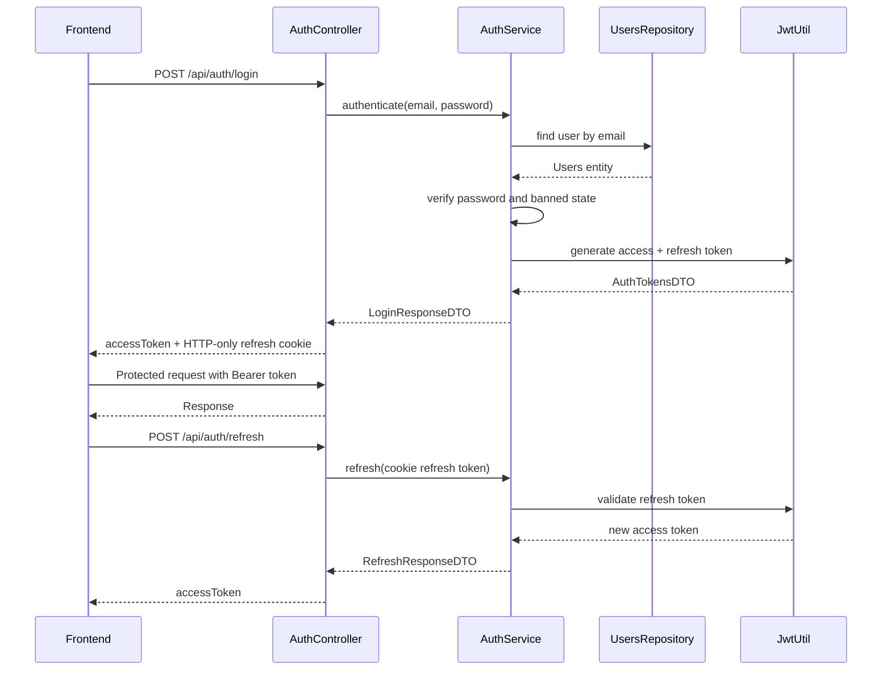

## Cart and Wishlist LLD

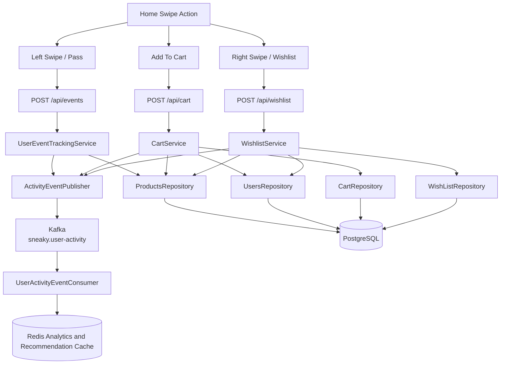

## Admin LLD

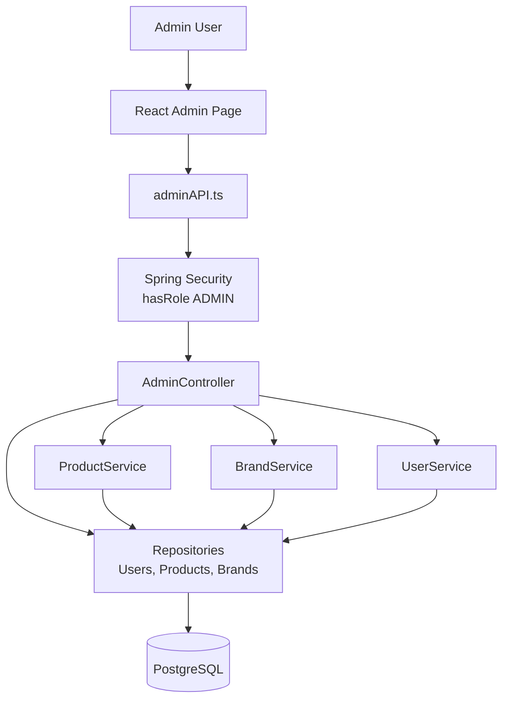
