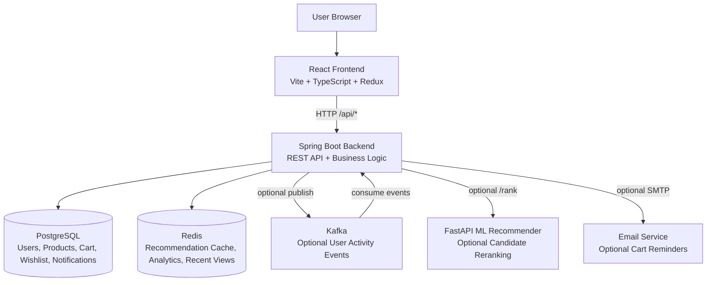
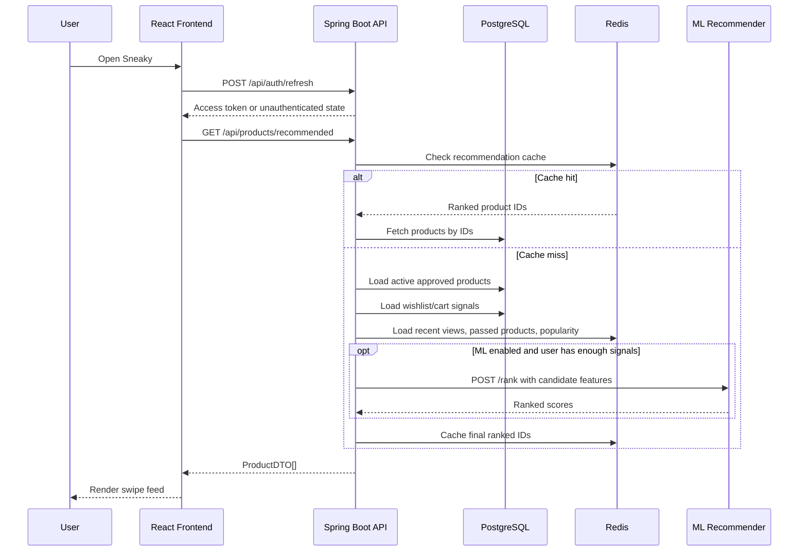
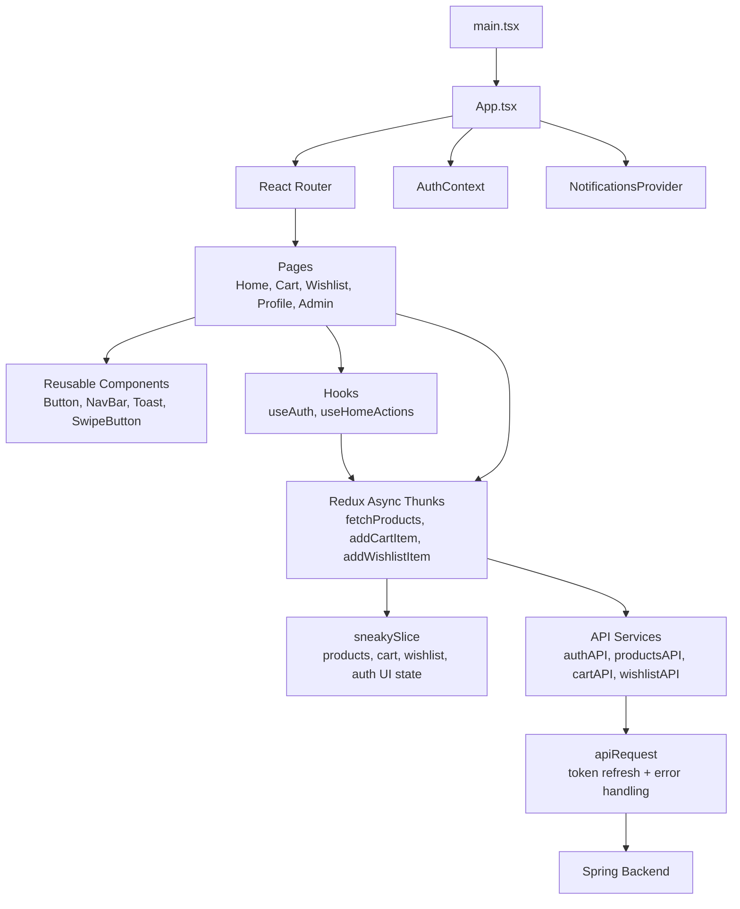
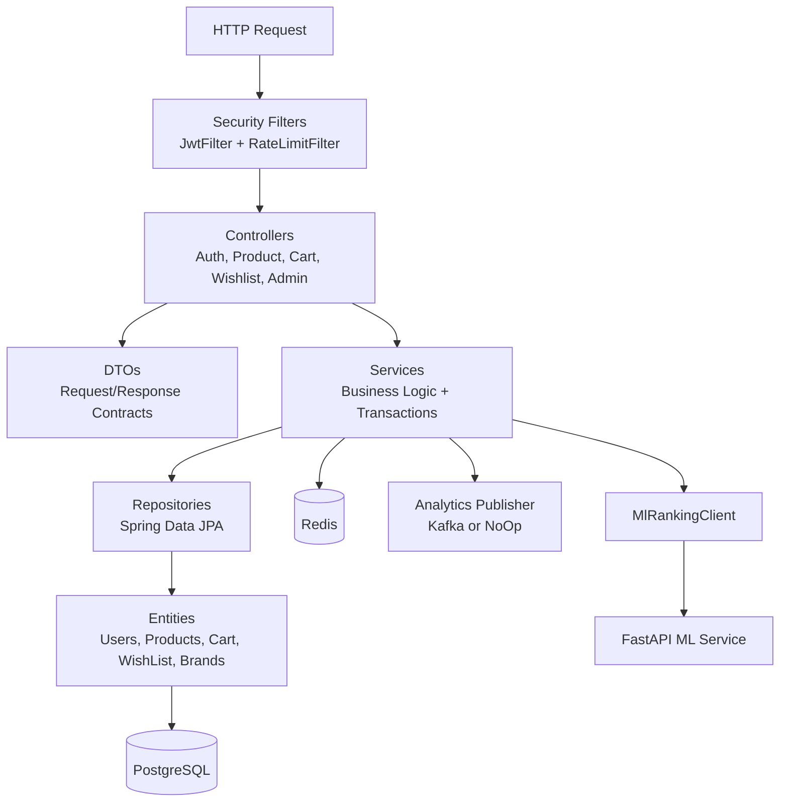
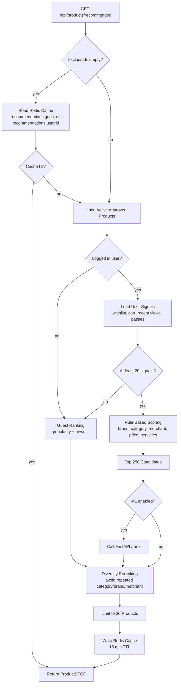
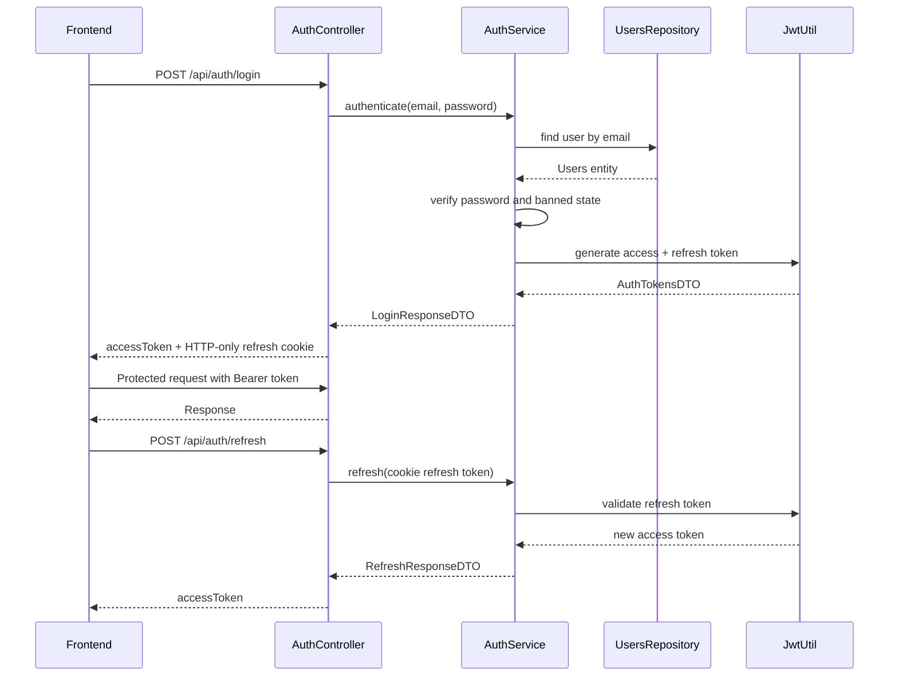
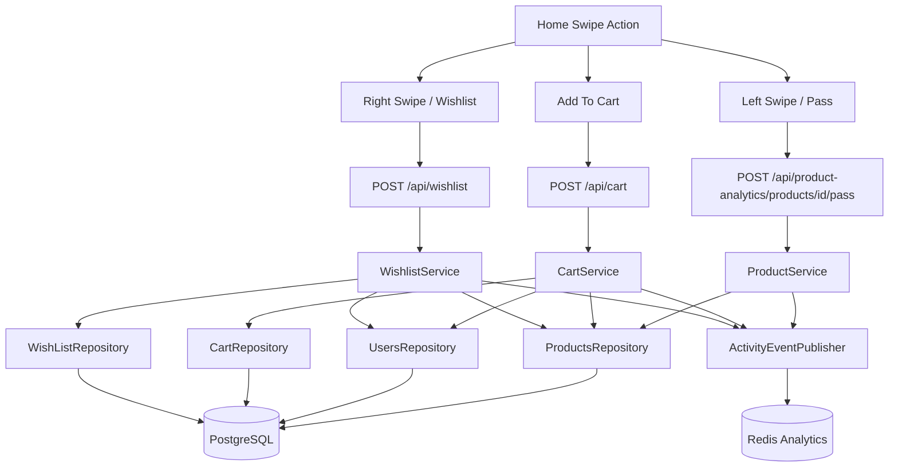
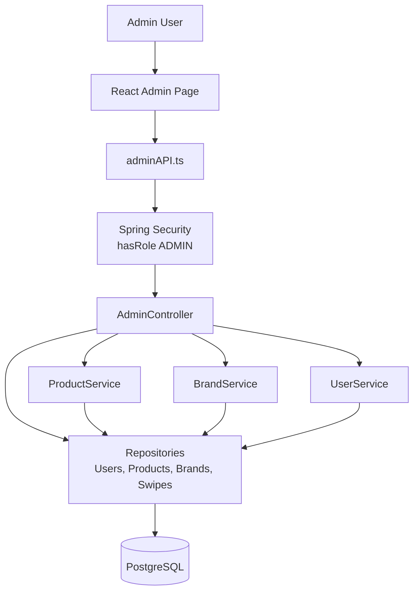

# Sneaky HLD and LLD Diagrams

## High-Level Design

## Runtime Request Flow

## Frontend Low-Level Design

## Backend Low-Level Design

## Recommendation LLD

## Authentication LLD

## Cart and Wishlist LLD

## Admin LLD

